# LitVMonitor

[](LICENSE)
[]()

> 当前版本：**v1.3.0**

轻量级**多协议监控系统**（HTTP / Ping / TCP / SSH / Telnet / FTP / VNC / MySQL / PostgreSQL / Redis / Memcached / MongoDB / ZooKeeper / AMQP / MQTT），无需安装代理。支持变量提取与传递（监控间数据联动）、SSL证书检测、域名证书管理、API签名、预请求脚本、代理设置（含连通性测试）、多渠道告警（邮件/Webhook/钉钉/企业微信/飞书）、Uptime统计、可配置公开状态页、API Schema可视化编辑与变更检测、巡检模式、周期提醒（含事务提醒）、多主题换肤、仪表盘自动刷新与备忘录与漏洞情报导航、版本展示。

---

## 界面预览

<table>
  <tr>
    <td><b>仪表盘</b><br>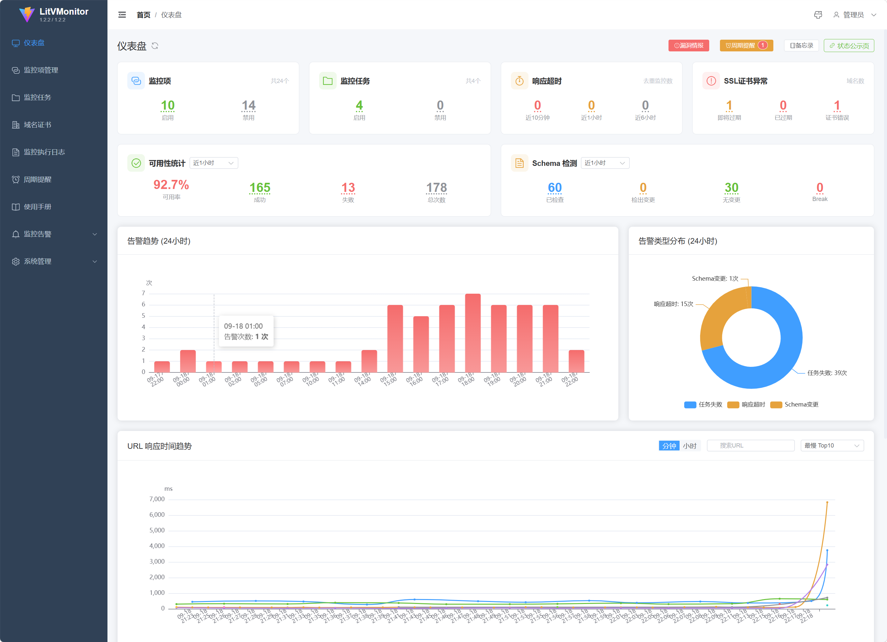</td>
    <td><b>登录页</b><br>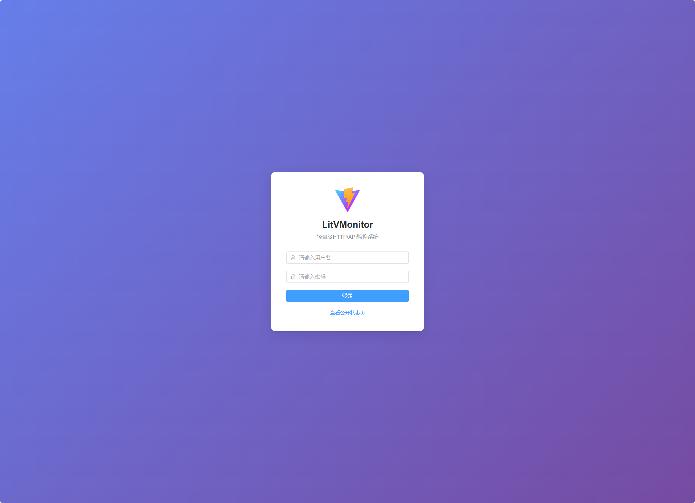</td>
  </tr>
  <tr>
    <td><b>监控项管理</b><br>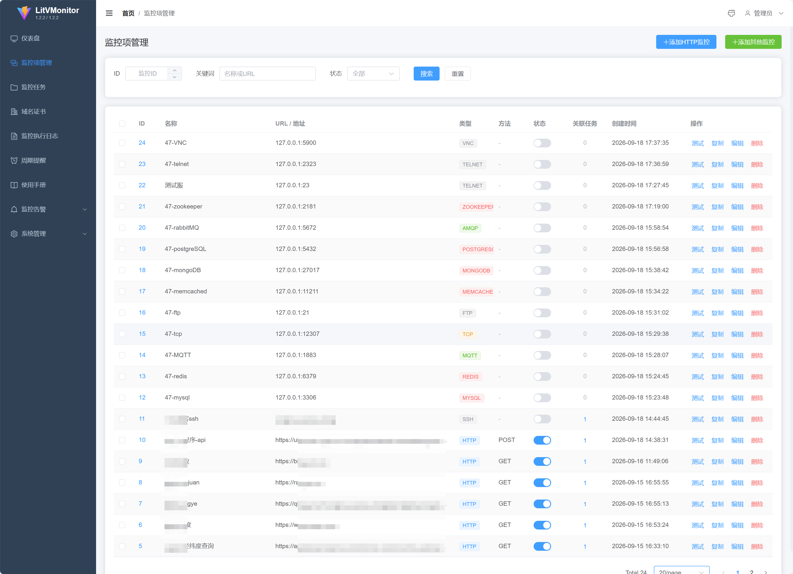</td>
    <td><b>HTTP 监控配置</b><br>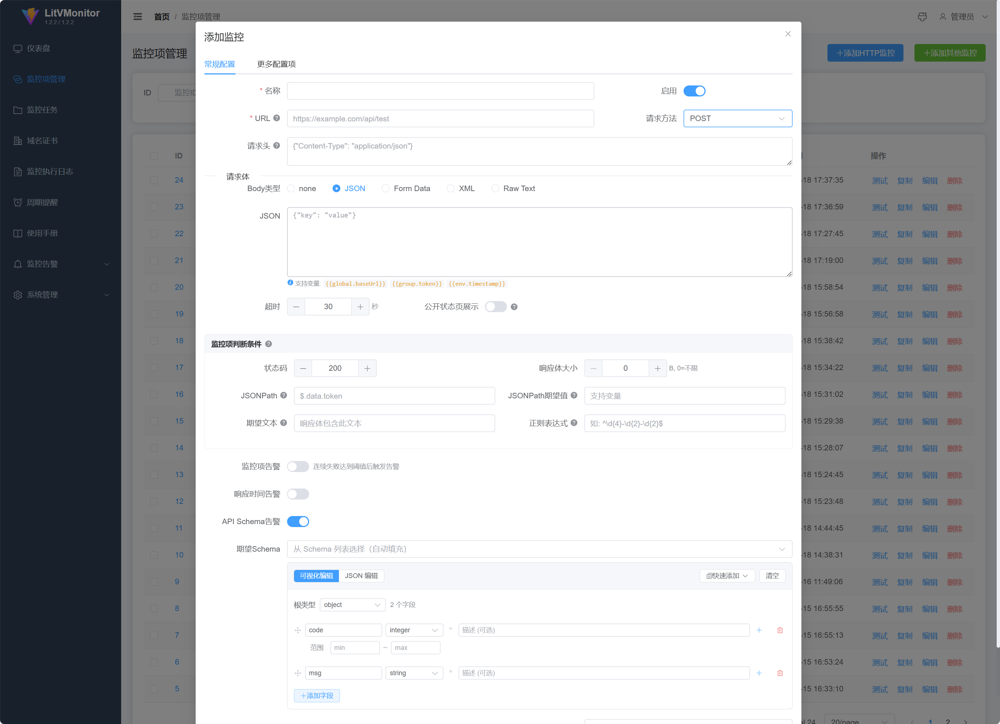</td>
  </tr>
  <tr>
    <td><b>监控任务</b><br>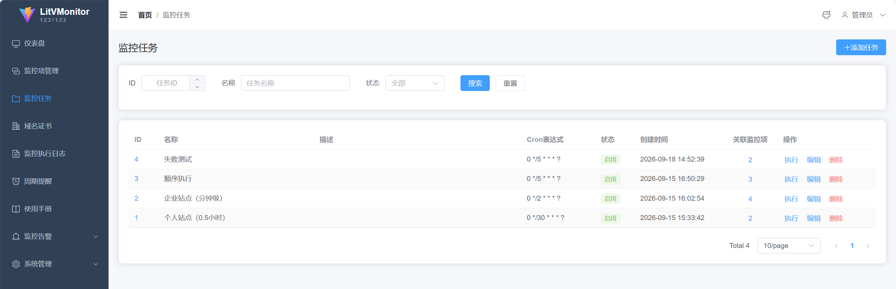</td>
    <td><b>执行日志</b><br>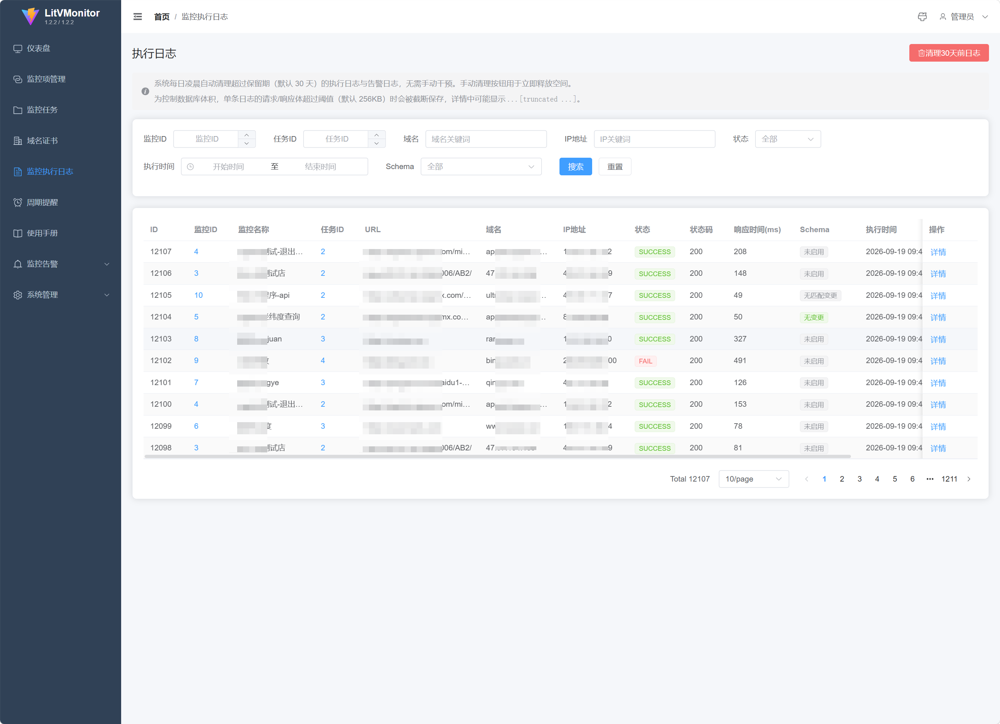</td>
  </tr>
  <tr>
    <td><b>告警模板</b><br>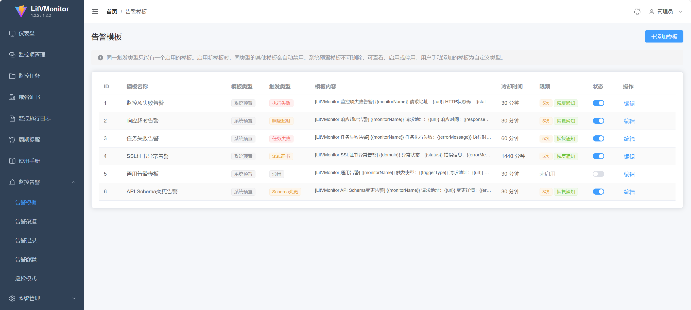</td>
    <td><b>告警渠道</b><br>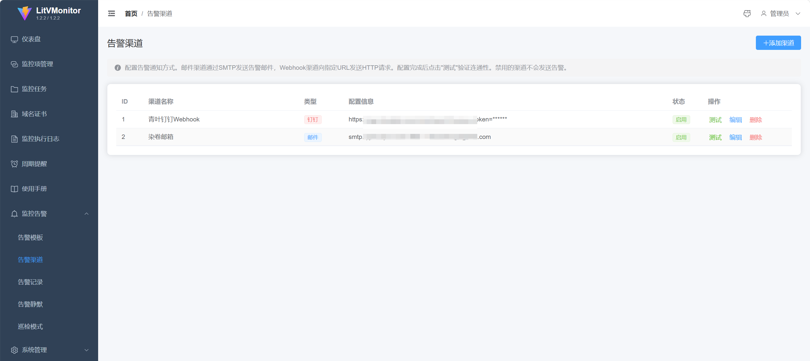</td>
  </tr>
  <tr>
    <td><b>深色主题</b><br>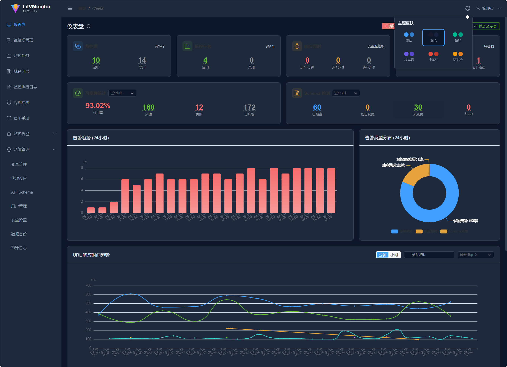</td>
    <td><b>浅色主题</b><br>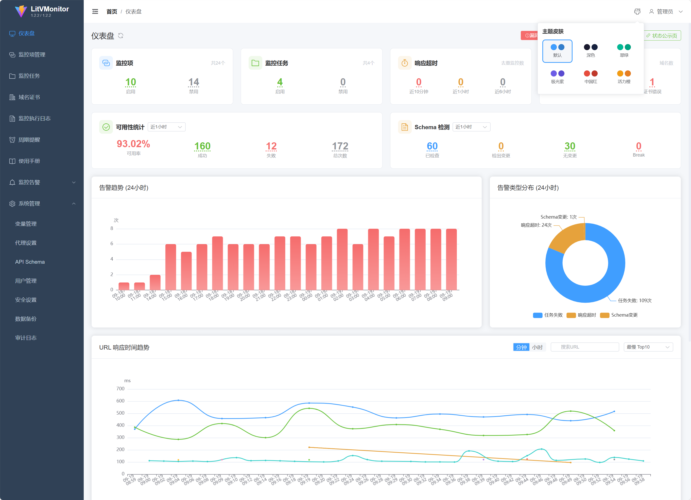</td>
  </tr>
  <tr>
    <td><b>公开状态页</b><br>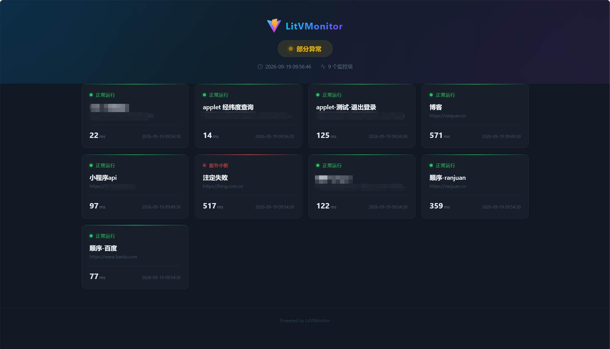</td>
    <td><b>API Schema</b><br>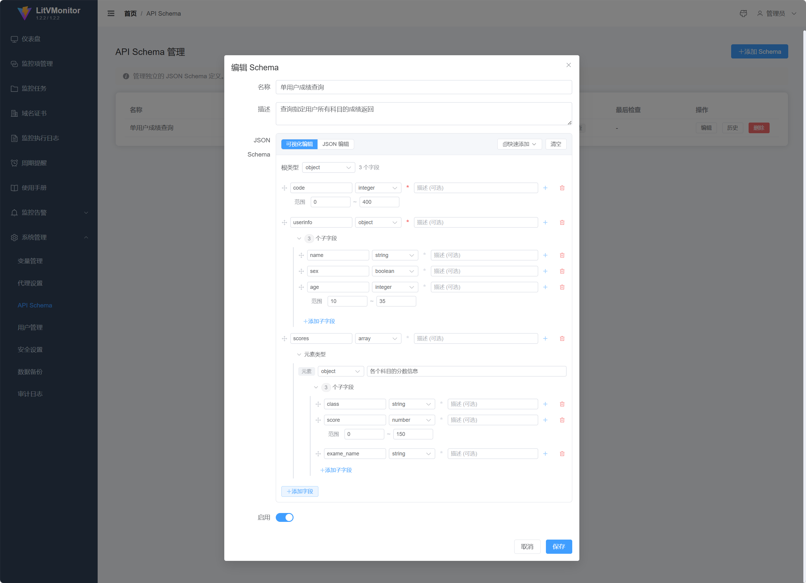</td>
  </tr>
</table>

> 更多截图见 [docs/demo/](docs/demo/)

---

## 文档索引

| 文档 | 内容 | 适用场景 |
|------|------|----------|
| [项目说明](docs/overview.md) | 功能清单、技术栈、用户角色权限矩阵 | 了解项目全貌 |
| [操作说明](docs/operation.md) | 快速启动、配置说明、变量系统、执行流程、前端路由、预请求脚本API | 部署和使用 |
| [软件架构](docs/architecture.md) | 项目结构、数据库设计、API接口、性能与并发、安全机制 | 技术选型和架构设计 |
| [开发规范](docs/development.md) | 后端/前端/数据库规范、踩坑与Bug记录 | 二次开发和维护 |
| [开发日志](docs/devlog.md) | 按日期记录每次改动的文件、原因、遇到的问题 | 日常开发回溯 |
| [迭代修复记录](docs/changelog.md) | 架构重构、性能优化、安全加固、依赖清理记录（版本级别） | 版本变更追踪 |

---

## 快速启动

### 环境要求

- JDK 17+
- Maven 3.8+
- Node.js 18+
- npm

### 后端启动

```bash
cd litv-monitor-server
mvn spring-boot:run
```

或使用启动脚本（自动定位目录和 JDK）：

| 平台 | 启动 | 停止 |
|------|------|------|
| Windows | `start.bat` | `stop.bat` |
| Linux | `./start.sh` | `./stop.sh` |
| 通用 | `java -jar litv-monitor-1.3.0.jar` | `Ctrl+C` 或 `kill` |

> ⚠️ **必须在 `litv-monitor-server` 目录下启动**：数据库路径 `jdbc:sqlite:./litv-monitor.db` 是相对路径，在其它目录启动会生成一个空库。

后端启动后：
- 监听端口：`8088`
- 上下文路径：`/api`
- SQLite 数据库文件：`litv-monitor-server/litv-monitor.db`（WAL 模式，自动创建）
- 首次启动自动创建管理员账户 `admin`，初始密码为随机强密码，**仅在启动日志中输出一次**；也可通过环境变量 `ADMIN_INIT_PASSWORD` 预设
- 首次登录会被强制要求修改密码（也可用 `ADMIN_INIT_PASSWORD` 预设后直接使用）

### 前端启动

```bash
cd litv-monitor-web
npm install
npm run dev
```

前端启动后：
- 监听端口：`5173`
- API 代理：`/api` → `http://localhost:8088`
- 访问：`http://localhost:5173`

---

## 技术栈

| 层级 | 技术 | 版本 |
|------|------|------|
| 后端框架 | Spring Boot | 3.2.5 |
| 安全 | Spring Security | 6.2.4 |
| ORM | MyBatis-Plus | 3.5.5 |
| 数据库 | SQLite (WAL 模式) | 3.45.1 |
| 缓存 | Caffeine | 3.1.8 |
| HTTP 客户端 | OkHttp | 4.12.0 |
| JWT | JJWT | 0.12.5 |
| 脚本引擎 | GraalVM Polyglot (JS) | 24.1.1 |
| 工具库 | Hutool | 5.8.32 |
| 前端框架 | Vue 3 | 3.5 |
| UI 组件库 | Element Plus | 2.14 |
| 图表 | ECharts | 5.6 |
| 状态管理 | Pinia | 2.3 |
| HTTP 客户端(前端) | axios | 1.20 |
| 构建工具 | Vite | 5.4 |
| 拖拽排序 | vuedraggable | 4.1 |

---

## 项目结构

```
LitVMonitor/
├── litv-monitor-server/           # Spring Boot 后端
│   ├── src/main/java/com/litv/monitor/
│   │   ├── config/                # 配置类 (Security, MyBatis, DB迁移, Async, Jackson, TypeHandler)
│   │   ├── security/              # JWT 认证 (Filter, Token, UserDetailsService)
│   │   ├── entity/                # 27 个实体类
│   │   ├── mapper/                # 27 个 MyBatis-Plus Mapper
│   │   ├── executor/              # 多协议执行器 (接口 + 注册表 + 抽象基类 + 15 种协议实现)
│   │   ├── service/               # 27 个业务服务 (含 SsrfProtectionService)
│   │   ├── service/script/        # 预请求脚本引擎 (GraalJS 沙箱 + ScriptRuntime 宿主对象 + 内置签名)
│   │   ├── controller/            # 22 个 REST 控制器
│   │   ├── dto/                   # 18 个数据传输对象
│   │   ├── enums/                 # 7 个枚举
│   │   ├── util/                  # 工具类 (DateTimeUtil, IpUtils)
│   │   └── scheduler/             # 定时任务 (Cron 调度)
│   └── src/main/resources/
│       ├── application.yml
│       └── db/
│           ├── schema.sql         # 建表语句
│           └── migration.sql      # 迁移脚本
│
├── litv-monitor-web/              # Vue3 前端
│   ├── src/
│   │   ├── api/index.js           # Axios 封装 + 全部 API 接口
│   │   ├── utils/format.js        # 时间格式化工具 (北京时间)
│   │   ├── permissions.js         # 集中式权限定义 (菜单 + 按钮)
│   │   ├── directives/permission.js # v-permission 指令
│   │   ├── router/index.js        # 路由 + 角色鉴权守卫
│   │   ├── stores/user.js         # Pinia 用户状态
│   │   ├── stores/theme.js        # Pinia 主题状态 (6 套皮肤)
│   │   ├── layout/MainLayout.vue  # 侧边栏 + 顶栏布局 (含换肤入口)
│   │   ├── styles/index.scss      # 全局样式 + 主题 CSS 变量
│   │   └── views/                 # 22 个页面视图
│   └── vite.config.js             # Vite 配置 + API 代理
│
├── docs/                          # 文档目录
│   ├── overview.md                # 项目说明
│   ├── operation.md               # 操作说明
│   ├── architecture.md            # 软件架构
│   ├── development.md             # 开发规范
│   ├── devlog.md                  # 开发日志（按日期）
│   └── changelog.md               # 迭代修复记录（版本级别）
│
└── README.md
```

---

## 默认账户

- 用户名：`admin`
- 初始密码：首次启动时**随机生成并仅在启动日志中输出一次**（也可用环境变量 `ADMIN_INIT_PASSWORD` 预设）
- **首次登录会被强制要求修改密码**（密码策略：≥8位且同时包含大写字母、小写字母和数字）
- 已存在的 `admin` 账号若仍在使用历史默认密码 `admin123`，启动时会自动标记为必须改密

---

## 环境变量

| 变量 | 默认值 | 说明 |
|------|--------|------|
| `ADMIN_INIT_PASSWORD` | 随机生成 | 首次启动创建 `admin` 时使用的初始密码 |
| `JWT_SECRET` | 自动生成并持久化到 `.jwt-secret` | JWT 签名密钥，设置时**至少 32 字符**；生产环境建议显式设置并备份 |
| `JWT_SECRET_FILE` | `./.jwt-secret` | 未设置 `JWT_SECRET` 时随机密钥的存放路径 |
| `SSL_VERIFY_DISABLED` | `true` | 是否跳过监控请求的 SSL 证书校验。默认 `true` 兼容自签名/证书链不完整场景；JVM 信任库正确时建议设为 `false` |
| `SSRF_PROTECTION` | `true` | SSRF 防护的**初始默认值**（首次初始化写入设置）；实际模式在「安全设置 → 监控请求安全」中配置 |
| `MAIL_HOST` | smtp.gmail.com | SMTP 服务器 |
| `MAIL_PORT` | 587 | SMTP 端口 |
| `MAIL_USERNAME` | - | SMTP 用户名 |
| `MAIL_PASSWORD` | - | SMTP 密码 |
| `CORS_ORIGINS` | http://localhost:5173,http://localhost:3000 | 允许的跨域来源 |

> 提示：若系统部署在内网、需要监控内网地址，可在「系统管理 → 安全设置 → 监控请求安全」将防护模式改为 **允许内网**（仍拦截云元数据）或 **关闭**，最多 5 秒生效、无需重启。

---

## 安全特性

| 特性 | 说明 |
|------|------|
| JWT 认证 | 无状态 Token + JTI 会话吊销；密钥来自 `JWT_SECRET` 或随机持久化，已移除可预测的 MAC 派生 |
| 权限实时校验 | 角色每次请求从数据库加载，降权即时生效；支持会话上限与踢下线 |
| 强制改密 | 新建/重置/初始账号首次登录强制修改密码（后端 428 拦截 + 前端弹窗） |
| RBAC 权限 | 三角色（ADMIN/OPERATOR/VIEWER），前后端双重校验；VIEWER 不返回监控敏感字段 |
| 密码安全 | BCrypt 哈希，≥8位且同时包含大小写字母和数字 |
| SSRF 防护 | **连接期**校验实际解析 IP（回环/内网/CGNAT/链路本地/云元数据/IPv6），覆盖全部协议执行器与告警 webhook，缓解 DNS rebinding；防护模式可在「安全设置」切换 strict/allow_internal/off |
| 脚本沙箱 | GraalVM 沙箱仅暴露白名单 `crypto`/`util` 宿主函数，不授予任意 Java 访问 |
| 登录锁定 | 连续失败达阈值自动锁定（默认开启，可在「安全设置」调整） |
| 审计日志 | 记录关键操作，密码等敏感字段脱敏 |
| SQL 注入防护 | MyBatis-Plus LambdaQueryWrapper 参数化查询 |
| CORS 可配置 | 通过环境变量限制允许的跨域来源 |
| 公开状态页可控 | 默认关闭匿名访问，需在安全设置中显式开启 |
| IP来源配置 | 可配置获取真实IP的请求头、严格模式、可信代理列表 |

---

## 多协议监控

除 HTTP/HTTPS 外，还支持 14 种协议。所有协议均支持响应时间告警、连续失败告警、加入监控任务与巡检、公开状态页展示：

| 分类 | 协议 | 默认端口 | 检测方式 |
|------|------|----------|----------|
| 网络探测 | Ping | - | ICMP 可达性 |
| 网络探测 | TCP | - | 端口连通性 |
| 远程登录/文件 | SSH | 22 | Banner 识别 |
| 远程登录/文件 | Telnet | 23 | Banner（无则发换行） |
| 远程登录/文件 | FTP | 21 | `220` Banner |
| 远程登录/文件 | VNC | 5900 | `RFB` 版本串 |
| 数据库/缓存 | MySQL | 3306 | Initial Handshake |
| 数据库/缓存 | PostgreSQL | 5432 | SSLRequest |
| 数据库/缓存 | Redis | 6379 | `PING` → `PONG` |
| 数据库/缓存 | Memcached | 11211 | `version` |
| 数据库/缓存 | MongoDB | 27017 | OP_MSG `hello` |
| 数据库/缓存 | ZooKeeper | 2181 | `ruok` → `imok` |
| 消息队列 | AMQP / RabbitMQ | 5672 | 协议头握手 |
| 消息队列 | MQTT | 1883 | CONNECT → CONNACK |

- 创建入口：监控项管理 →「添加其他监控」
- 均为匿名/半匿名探测：即使目标要求认证，能收到协议响应即证明服务存活
- 架构：`MonitorExecutor` 策略接口 + `MonitorExecutorRegistry` 自动注册，新增协议只需实现一个执行器

---

## 界面主题

顶栏用户信息左侧提供换肤入口，支持 6 套主题，选择结果保存在浏览器 `localStorage`（刷新保持）：

| 主题 | 主色 | 说明 |
|------|------|------|
| 默认 | `#409eff` 蓝 | 浅色默认皮肤 |
| 深色 | `#1e293b` | 全局深色模式（含表格/弹窗/表单/固定列适配） |
| 翠绿 | `#00b894` | 绿色主题 |
| 极光紫 | `#6c5ce7` | 紫色主题 |
| 中国红 | `#e74c3c` | 红色主题 |
| 活力橙 | `#f39c12` | 橙色主题 |

主题通过 CSS 变量（`--primary-color`、`--bg-color`、`--card-bg` 等）实现，Element Plus 组件在深色模式下有专门覆盖。公开状态页为独立的深色科技风设计，不受主题切换影响。

---

## 公开状态页

- **访问路径**：`/status`
- **默认行为**：匿名不可访问（返回 403），需在「系统管理 → 安全设置 → 公开状态页」开启「允许匿名访问」
- **展示范围**：仅展示在监控项中开启「公开状态页展示」开关的项目
- **界面**：深色科技风，卡片网格自适应布局（1-4 列），30 秒自动刷新，状态圆点脉冲动画

---

## 开发工具

本项目使用 [OpenCode](https://opencode.ai) 开发。
